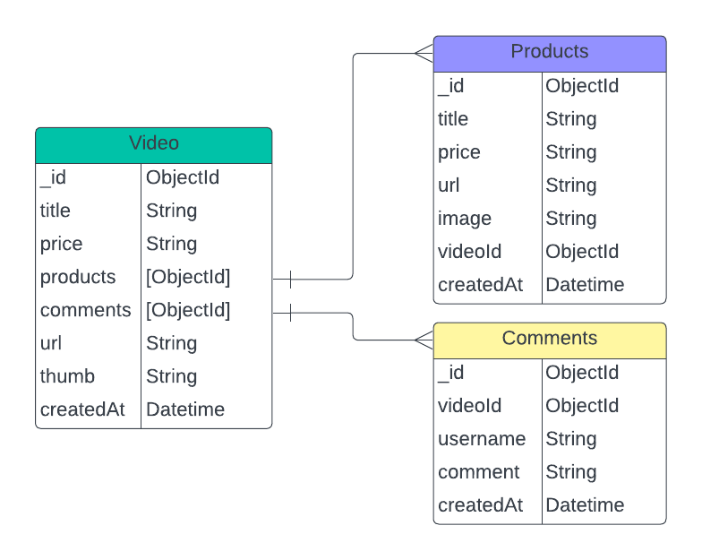

# Generasi Gigih MID-TERM API Project

## How to Run

1. Make sure you have Node JS installed (v19.7.0 recommended).
2. Clone this Repo.
3. install the packages with `npm install` or `yarn install`.
4. run using `npm start` or simply just `yarn start`.
5. Check the Docs Below and Enjoy!

## API Documentation

The Documentation can be accessed [Here](https://gist.github.com/Syaipuddin/6d74588ce2127e73674148c3b412c4b3)

## Database Structure

